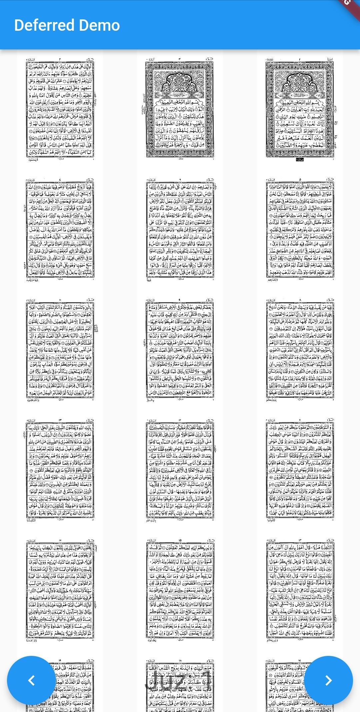
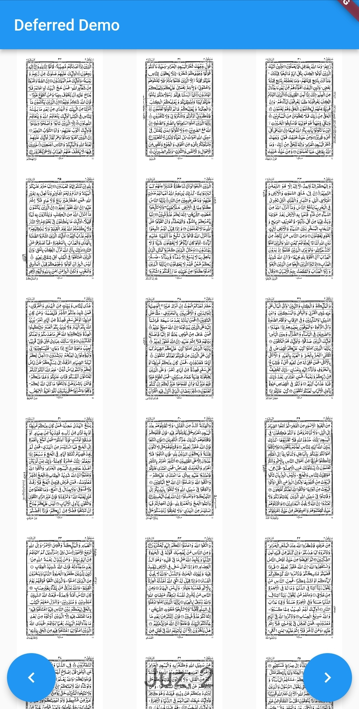

# Flutter Deferred Assets Components

Flutter allows us to split our application into smaller, more manageable pieces called "deferred components".

Deferred components allow us to split our app's code into smaller chunks that can be loaded on demand when needed,
rather than loading everything at once.

### Is Deferred Components is an alternatives of APK Expansion file?

No. Deferred Components allow reducing app size and load apps dynamic features on-demand. On the other hand APK
Expansion files are a mechanism to include additional resources.

### Google Play Store file upload size

| Extension | Size limit |            Comment            |
|:---------:|:----------:|:-----------------------------:|
|    APK    |   100 MB   |                               |        
|    OBB    |    2 GB    |             Each              |        
|    AAB    |   150 MB   |                               |        
|    AAB    |  150+ MB   | With Dynamic Features Enabled |        


### References
* Read about <a href="https://docs.flutter.dev/perf/deferred-components">Deferred components</a>
* Stackoverflow <a href="https://docs.flutter.dev/perf/deferred-components">How to use deferred components in Flutter (with a focus on assets-only components)?</a> links to tell you about what other developers are doing. Though the provided answer is not correct.

### App Size

Run this command
```commandline
flutter build appbundle --no-validate-deferred-components --analyze-size --target-platform android-arm
```

```commandline

Building with sound null safety 

app-release.aab (total compressed)                                         30 MB
━━━━━━━━━━━━━━━━━━━━━━━━━━━━━━━━━━━━━━━━━━━━━━━━━━━━━━━━━━━━━━━━━━━━━━━━━━━━━━━━
  BUNDLE-METADATA/
    com.android.tools.build.libraries                                       2 KB
  base/
    assets                                                                  1 MB
    dex                                                                     2 MB
    lib                                                                     5 MB
    Dart AOT symbols accounted decompressed size                            4 MB
      package:flutter                                                       2 MB
      dart:core                                                           312 KB
      dart:typed_data                                                     241 KB
      dart:ui                                                             205 KB
      dart:collection                                                     144 KB
      dart:async                                                           84 KB
      dart:convert                                                         65 KB
      dart:io                                                              44 KB
      package:vector_math/
        vector_math_64.dart                                                28 KB
      dart:isolate                                                         27 KB
      dart:ffi                                                             14 KB
      dart:developer                                                        8 KB
      package:flutter_deferred                                              5 KB
      package:collection/
        src/
          priority_queue.dart                                               5 KB
      dart:math                                                             3 KB
      dart:vmservice_io                                                    828 B
      dart:mirrors                                                         559 B
      dart:nativewrappers                                                  227 B
      Never                                                                 52 B
      void/
        <optimized out>                                                     44 B
    manifest                                                                2 KB
    res                                                                    18 KB
    resources.pb                                                            8 KB
    root                                                                   10 KB
  juz1/
    assets                                                                 11 MB
  juz2/
    assets                                                                 11 MB
  META-INF/
    ANDROIDD.SF                                                             7 KB
    ANDROIDD.RSA                                                          1017 B
    MANIFEST.MF                                                             7 KB
    
√ Built build\app\outputs\bundle\release\app-release.aab (30.2MB).
```

There have two deferred components

| Extension | Size  |  Comment   |
|:---------:|:-----:|:----------:|
|    AAB    | 30 MB | MAX 150 MB |        
|   juz1    | 11 MB | MAX 150 MB |        
|   juz2    | 11 MB | MAX 150 MB |  


### Screenshots

|           JUZ 1           |           JUZ 2           |
|:-------------------------:|:-------------------------:|
|  |  |


## 💻 Installation steps

Clone or download this project in your working directory, Open using android studio, Sync the
project, build & run the project.


## 🧑 Author

#### Md. Imam Hossain

You can also follow my GitHub Profile to stay updated about my latest projects:

[](https://github.com/imamhossain94)

If you liked the repo then kindly support it by giving it a star ⭐!

Copyright (c) 2023 MD. IMAM HOSSAIN
